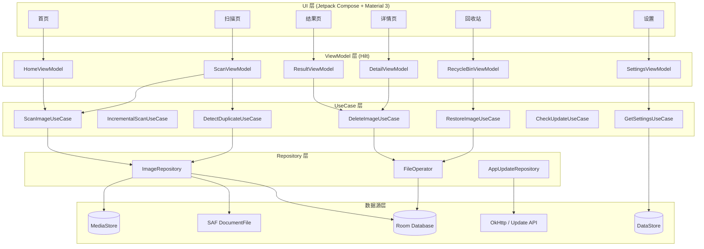
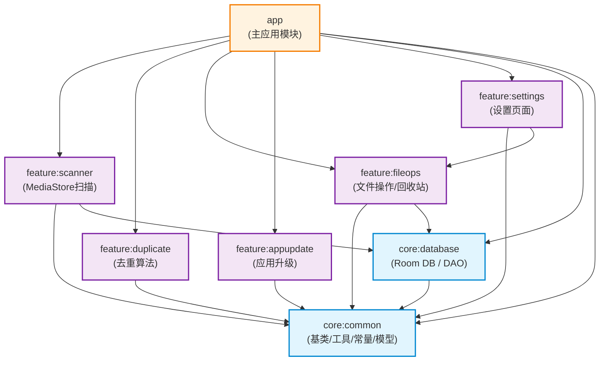
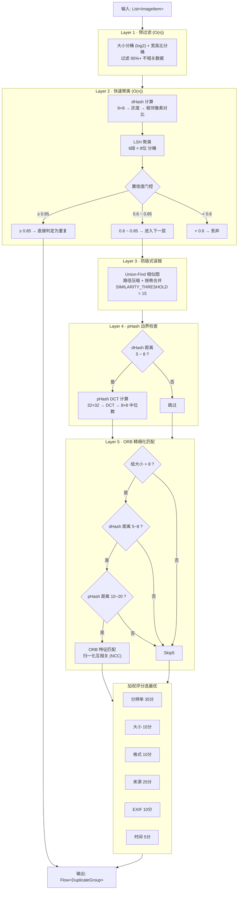
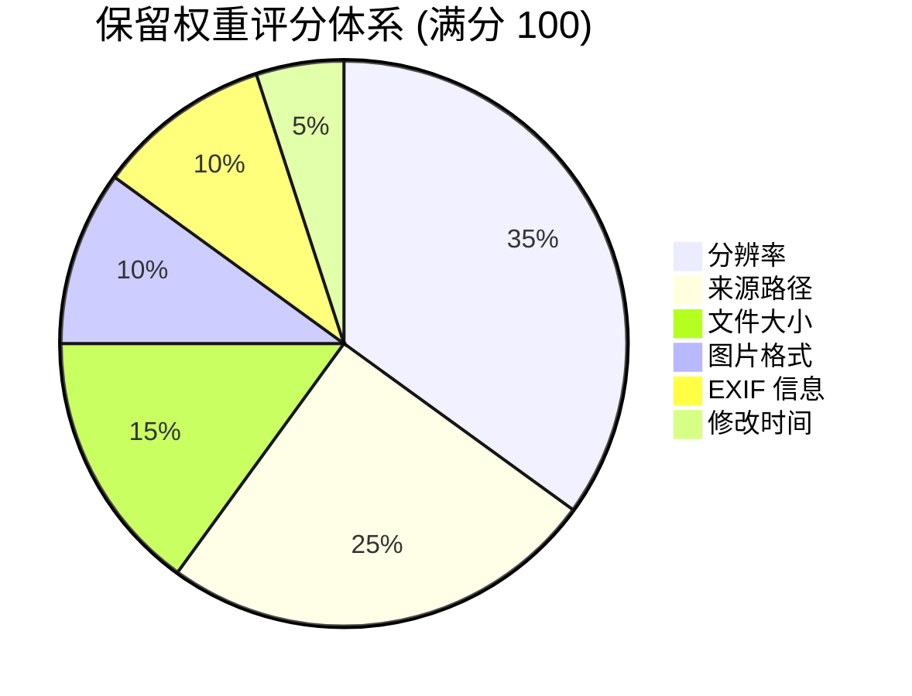
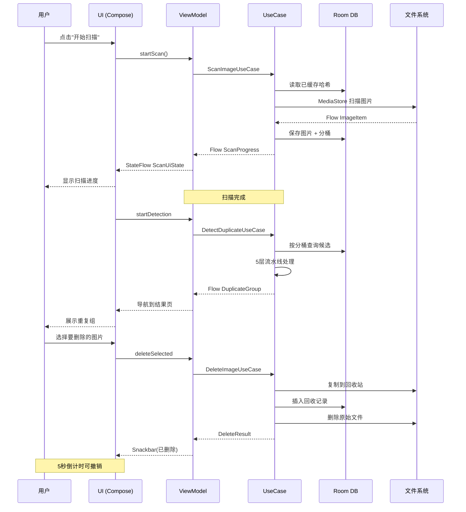
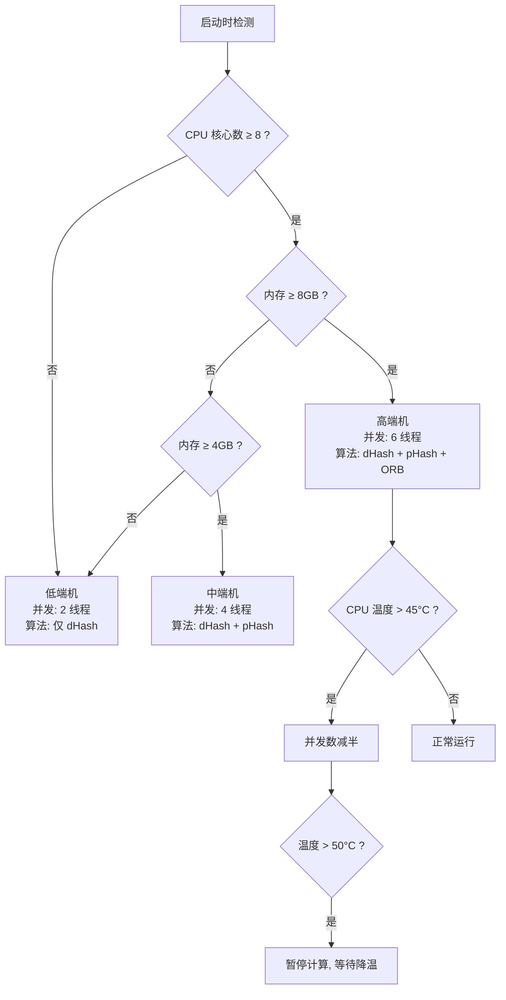

# 清图大师 PhotoCleaner

一键去重，释放存储空间。

> 纯本地、轻量、高精度的安卓图片文件去重工具。  
> **102 个 Kotlin 源文件 · 8 个模块 · MVVM + Clean Architecture**

---

## 项目简介

PhotoCleaner（清图大师）是一款完全离线的 Android 图片去重应用。通过**五层感知哈希算法流水线**（dHash → LSH → Union-Find → pHash → ORB）精准识别完全重复和高度相似的图片，帮助用户安全清理冗余文件，释放存储空间。

### 核心价值

| 特性 | 说明 |
|------|------|
| 🔒 **纯本地运算** | 所有扫描、对比、删除操作均在本地完成，不上传任何数据 |
| ⚡ **高速扫描** | 10000 张图片 ≤ 8 秒出首屏结果，50000 张 ≤ 90 秒（中端机） |
| 🎯 **高精度识别** | 完全重复 100%，相似图片 ≥ 98%，链式误分组率 ≤ 1% |
| 🛡️ **安全回收站** | 删除的文件进入回收站，30 天内可恢复，过期自动清理 |
| 📱 **广泛适配** | Android 8.0 ~ 14+，分区存储完整适配，支持折叠屏 |
| 🌡️ **智能降级** | 根据设备性能自动调节并发数与算法档位，高温/低内存自动降级 |

---

## 技术架构

### 分层架构总览



### 模块依赖关系



### 技术栈

| 层级 | 技术选型 |
|------|----------|
| 语言 | 100% Kotlin |
| UI | Jetpack Compose + Material 3 + Navigation Compose |
| 架构 | MVVM + Clean Architecture + 多模块 |
| 异步 | Kotlin Coroutines + Flow（流式流水线） |
| DI | Hilt （@Singleton / @HiltViewModel / @HiltWorker） |
| 数据库 | Room 2.6+（WAL 模式，5 实体，4 DAO） |
| 图片加载 | Coil 2.5+（Compose 集成） |
| 网络 | OkHttp 4.12（断点续传、进度回调） |
| 任务调度 | WorkManager（回收站每日自动清理） |
| 构建 | Gradle 8.5 + Kotlin DSL + KSP |

---

## 去重算法

### 五层流水线



### 保留权重量化评分体系



| 维度 | 满分 | 评分依据 |
|------|------|----------|
| 分辨率 | 35 | 像素越高分越高（上限 5000 万像素） |
| 来源路径 | 25 | DCIM/Camera=25, Pictures=15, Download=5 |
| 文件大小 | 15 | 越大越好（上限 20MB） |
| 图片格式 | 10 | PNG=10, WebP=7, JPEG=5, GIF=2 |
| EXIF 信息 | 10 | 含 EXIF 为 10 分 |
| 修改时间 | 5 | 近 7 天=5, 近 30 天=3, 近 90 天=1 |

---

## 数据流

### 扫描 → 去重 → 清理 主链路



### 设备智能分级决策



---

## 快速开始

### 环境要求

- **Android Studio** Hedgehog (2023.1.1) 或更新版本
- **JDK** 17+
- **Gradle** 8.5（wrapper 已内置）
- **Android SDK** 34

### 构建

```bash
# 克隆项目
git clone <repo-url>
cd PhotoCleaner

# 调试构建
./gradlew assembleDebug

# 离线构建（网络受限环境）
./gradlew assembleDebug --offline

# 发布构建（含 R8 混淆 + 资源压缩）
./gradlew assembleRelease
```

> **网络受限环境**：若无法访问 `services.gradle.org`，可直接使用本地缓存的 Gradle 8.5
> （位于 `~/.gradle/wrapper/dists/gradle-8.5-bin/`），或在 Android Studio 中
> 设置 **File → Settings → Build → Gradle → Offline work**。

### 运行测试

```bash
# 运行所有单元测试
./gradlew test

# 按模块运行
./gradlew :core:common:test      # 工具类测试
./gradlew :feature:duplicate:test # 核心算法测试

# 特定测试类
./gradlew :feature:duplicate:test --tests "*HammingDistanceMatcherTest*"
```

### 安装到设备

```bash
./gradlew installDebug
```

构建产物位置：`app/build/outputs/apk/debug/app-debug.apk`

---

## 详细文档

| 文档 | 说明 |
|------|------|
| [📖 构建与测试指南](docs/build-guide.md) | 环境配置、构建命令、测试操作、常见问题 |
| [📐 详细设计方案](PhotoCleaner详细设计方案.md) | 完整工程级设计文档（V1.5） |

---

## 当前状态

| 维度 | 完成度 | 说明 |
|------|--------|------|
| 项目骨架（模块/构建/DI） | ✅ 100% | 8 模块，Hilt 注入，Gradle 8.5 |
| 数据层（Room DB） | ✅ 100% | 5 实体 + 4 DAO + WAL + 索引 |
| 去重算法（5 层流水线） | ✅ 100% | dHash/LSH/UF/pHash/ORB + 置信度门控 + 加权评分 |
| 文件操作（回收站） | ✅ 100% | 删除/恢复/30天过期/WorkManager 自动清理 |
| 应用内升级 | ✅ 100% | 检测/MD5校验/OkHttp下载/FileProvider安装 |
| 设置（DataStore） | ✅ 100% | 6 组设置项，深色/浅色/跟随系统主题 |
| 系统适配 | ✅ 100% | 权限分版本/分区存储/前台 Service/FileProvider |
| 性能优化 | ✅ 100% | 设备分级/LSH O(n)/流式 Flow/降级策略 |
| 异常处理 | ✅ 100% | 分级日志/文件轮转/WorkManager 重试/全局崩溃捕获 |
| MVP 主链路 | ✅ 100% | 首页→扫描→结果→详情→回收站→设置 完整闭环 |

---

## 版本规划

| 版本 | 功能 | 状态 |
|------|------|------|
| V1.0 MVP | 完全重复检测、相似图片检测、回收站、基础设置、应用内升级 | ✅ **已完成** |
| V1.1 | 相似截图清理、模糊图片检测、微信/QQ 专项扫描、算法精度优化 | 📅 规划中 |
| V1.2 | 大文件清理、截图智能分类、批量导出备份、白名单、扫描历史 | 📅 规划中 |

---

## 许可证

[MIT](LICENSE)
